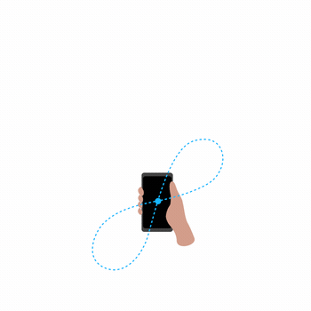

# Zephr Demo Application
Android demo application to demonstrate the capabilities of the Zephr SDK.

## Getting Started

To build and run the demo app:

 1. Clone or download this repository.
 2. Open the project in Android Studio.
 3. Create a `secrets.properties` file in your project root direction and populate it by following the steps in the next section.
 4. Sync your project with Gradle.
 5. Build and run the app on a physical Android device (an Android emulated device does not receive GNSS measurements so cannot produce a Zephr position).

## Authenticating with Secrets Gradle Plugin
 There are a couple of steps needed to authenticate packages required in the app. We are using [secrets gradle plugin](https://github.com/google/secrets-gradle-plugin) to authenticate certain APIs, so you should place the following for each of these packages in a file titled `secrets.properties` in your project root directory:

 ### Zephr API
 If you do not have credentials, head to https://zephr.xyz/developer-portal to get started.
 ```
 # API credentials
API_USERNAME=YOUR_ZEPHR_USERNAME
API_PASSWORD=YOUR_ZEPHR_PASSWORD
# Zephr Overture API Base URL
API_BASE_URL=https://api.zephr.xyz
 ```

 ### Google Maps API
 You will need to provide your own Google Maps API key here.
 ```
 MAPS_API_KEY=YOUR_MAPS_API_KEY
 ```


## Compass Heading Troubleshooting
Sometimes the Android magnetometer can become uncalibrated, resulting in an inaccurate heading. This is a problem inherent to the sensor in the device and out of our control, however the magnetometer can usually be recalibrate by moving your device in a figure-eight pattern, as described in this [Google support forum response](https://support.google.com/maps/thread/5071162?hl=en&msgid=5100167).



## License
The code in this repository is licensed under the MIT License.
