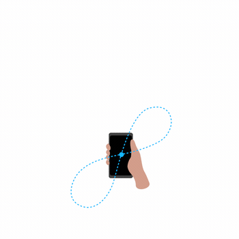

# Zephr Demo Application

Android demo application to demonstrate the capabilities of the Zephr SDK.

## Getting Started

To build and run the demo app:

1.  Clone or download this repository.
2.  Open the project in Android Studio.
3.  Create a `secrets.properties` file in your project root direction and populate it by following the steps in the next section.
4.  Sync your project with Gradle.
5.  Build and run the app on a physical Android device (an Android emulated device does not receive GNSS measurements so cannot produce a Zephr position).

## Authorizations needed for the demo app

The demo app uses both the zephr positioning sdk and the zephrture local AI platform.

Some steps are needed to authorize the app to use both of these services.

You'll need to signup for a zephr developer account to manage these authorizations.

If you do not have developer credentials, head to https://zephr.xyz/auth/signup/ to register.

### Authorizing the zephr corrections sdk

Usage of the zephr corrections sdk is authorized via the app developer's identity. For privacy reasons we do not require individual users of the sdk to authenticate in order to authorize and use this service.

To register your developer identity with zephr, enter the digest of the signing key you will use to build the app into [the Zephr Developer Portal sdk authorization page](https://zephr.xyz/developer-portal/?section=sdk).

Instructions for retrieving the necessary signing key details associated with your app can be found [here](https://zephr.xyz/developer-portal/cert-digest-instructions)

### Hard-code credentials for Zephrture API via Secrets Gradle Plugin

Usage of the Zephrture API requires user credentials during the soft launch period and for simplicity -- the demo app is setup for you to provide credentials for your user account at build time. In a real app user credentials for Zephrure api will be handled by app logic within a user login flow.

For this demo -- simply place your zephr developer portal username and password in a file titled `secrets.properties` in the project root directory -- replace `YOUR_ZEPHR_USERNAME` and `YOUR_ZEPHR_PASSWORD` in the example below

```
# API credentials
API_USERNAME=YOUR_ZEPHR_USERNAME
API_PASSWORD=YOUR_ZEPHR_PASSWORD
# Zephr Overture API Base URL
API_BASE_URL=https://api.zephr.xyz
```

### Google Maps API

You will also need to provide your own Google Maps API key in the same `secrets.properties` file for map imagery.

```
MAPS_API_KEY=YOUR_MAPS_API_KEY
```

## Compass Heading Troubleshooting

Sometimes the Android magnetometer can become uncalibrated, resulting in an inaccurate heading. This is a problem inherent to the sensor in the device and out of our control, however the magnetometer can usually be recalibrate by moving your device in a figure-eight pattern, as described in this [Google support forum response](https://support.google.com/maps/thread/5071162?hl=en&msgid=5100167).



## License

The code in this repository is licensed under the MIT License.
